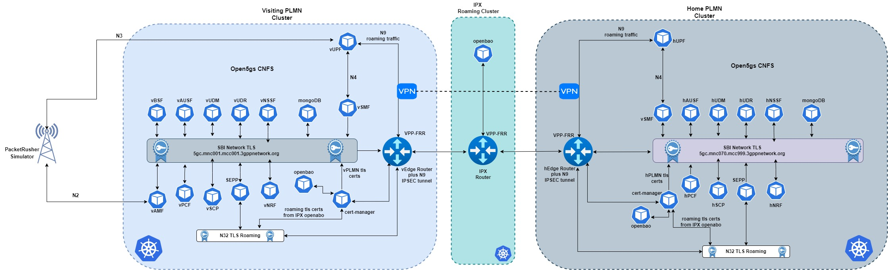

# Building a Cloud-Native 5G Roaming Architecture with Open5GS, cert-manager, and OpenBao: Supporting LBO and HR Modes

**Virtualization:** Proxmox

**Kubernetes Distro:** Microk8s

**5G Core:** Open5gs

**Simulator:** PacketRusher

**TLS Certs:** Openbao and cert-manager

**Routing and VPN:** VPP and FRR

The choice of Microk8s stems from the fact it makes it easy to have quick single-node k8s cluster with inbuilt support plugins like host-storage and Multus.

Architecture is shown below

I have included the deployment of each stage in the respective markdown docs located in the root of this repo.

Ideally:

- Create the k8s clusters

- Deploy the IPX routers, hPLMN and vPLMN edge helm charts to the respective clusters

- Install the OpenBao (all 3 clusters) and cert-manager (only the visiting and home clusters)

- Configure the Openbao for TLS certs generation

  N.B - The IPX Openbao is exposed via a metallb LB since the visiting and home cluster cert-manager will need to access it to generate the SEPP N32 certs

- Install the TLS certs helm charts in the visiting and home clusters

- Install the open5gs charts in the respective clusters.

- Deploy the PacketRusher VM and test.